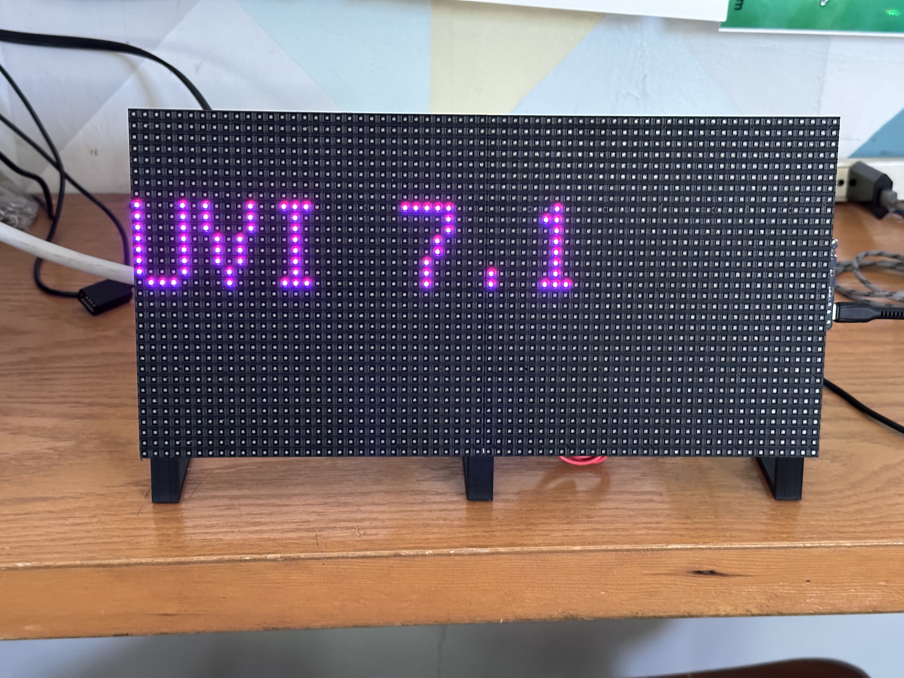

<!--
SPDX-FileCopyrightText: 2023 John Romkey

SPDX-License-Identifier: MIT
-->

# Give Me A Sign!

Give Me A Sign! is an info sign designed for hacker and makerspaces,
although you could use it in your home or office as well.

 
 

The sign will mostly look like a clock, while sometimes displaying
other useful information like messages, weather, air quality
information or whatever you push to it.

The sign is intended to be deployed and left aone. It doesn't pull
data (other than syncing its clock via NTP), data gets pushed to
it. The project includes examples of how to set up Home Assistant to
push data to the sign.

## Design Philosophy

In the age of connected devices one of the big questions becomes
"where should we do what?". For instance, should a smart sign that
shows the weather fetch the weather information itself, or would it be
better to push that information to it from a more capable computer?

Two important questions arise:

1. Is the device intended to be stand-alone, with no additional
   support? If so then obviously the complexity has to be in the
   device.
2. If the device is not intended to be stand-alone then where is the
   most appropriate place to put different functions?
   
Give Me A Sign! is not intended to run stand-alone. Its clock function
can but the biggest design decision here is to use an external source
(or sources) to push information to the sign rather than have it pull
information.

This allows much greater flexibility. For instance, PDX Hackerspace
has its own weather station. Rather than use weather conditions from a
weather service, we can use the ones that our weather station
reports. We still need weather forecasts, though, and we it's
convenient to pull the "current conditions" (like rain, snow,
volcanos, etc)  from an external source.

Pushing the data allows us to easily adapt to a mix of local and
remote sources and change that as we wish without having to update the
signs distributed around the space.

There are also questions about security. While it's difficult to
correctly protect secrets and sensitive information like passwords and
API keys on capable systems like Linux, it's even more difficult or
even impossible to protect them on embedded devices, especially
devices that people have physical access to. Not having them there at
all also means that you don't have to update certificates, change API
keys or keep other credentials up to date on devices where it's
inherently more difficult to do so.

## Hardware

This code is designed to run on an [Adafruit MatrixPortal
M4](https://www.adafruit.com/product/4745) board connected to a 64x32
LED matrix. It should work with other Adafruit Matrix products but it
hasn't been tested with them and might need adapting.

## Software

This project is written in CircuitPython. It depends on several
libraries that help manage the LED matrix, the ESP32 wifi
co-processor, the buttons, and the RTC modules.

The top level Python library is `GiveMeASign`, which loads the other
modules, manages the web server that provides the API,  and provides
the top level loop that manages data, runs the web server, and manages
the LED matrix screen.

## Preparing The Sign

### Update ESP32

The Matrix Portal uses an ESP32 as a network co-processor. The
firmware isn't under active development, but we'd like to be running
the latest available firmware.

Our Matrix Portals came with 1.2.2, as of this writing the current version is 1.7.4.


https://learn.adafruit.com/upgrading-esp32-firmware/upgrade-all-in-one-esp32-airlift-firmware


### Update CircuitPython


https://circuitpython.org/board/matrixportal_m4/

### Update UF2 Bootloader

This is the least necessary of the updates. If the bootloader is
working then it doesn't need to be updated, but it can be helpful to
run the latest code.

https://circuitpython.org/board/matrixportal_m4/

## Mounting

\#4-40 3/8" screws


## Installation

1. Follow the instructions

## API


## Displaying Images

Store the image as in indexed BMP format. Follow the code in nyan.py to display it. Can also load some GIFs and PNGs.

```
magick original.bmp -colors power-of-two output.bmp
```

Adafruit has [a good discussion of how to deal with indexed BMPs](https://learn.adafruit.com/creating-your-first-tilemap-game-with-circuitpython/indexed-bmp-graphics).

## Working with fonts

adafruit_bitmap_font.py

https://github.com/adafruit/Adafruit_CircuitPython_Bitmap_Font

## Weather Icons

## Home Assistant

```
service: rest_command.sign_tones
data:
  target: 10.0.1.123
  tones: '{ "frequency": 425, "duration": 0.5, "volume": 100 }, { "frequency": 100, "duration": 0.5, "volume": 100}'
```

## Timezones
